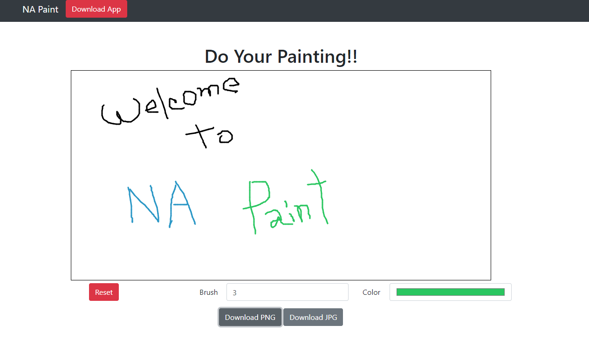
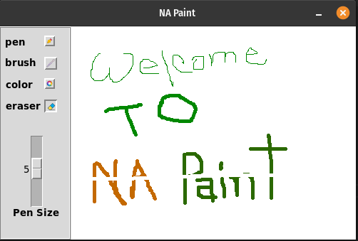

# NA Paint

Paint is a simple raster graphics editor that has been included with all versions. The program opens and saves files in JPEG, PNG formats. The program can be in color mode or two-color black-and-white.

# Online Website

This is a Js Based Website You can Use It live and Download Your ART on PNG or JPEG format.

[Visit](https://naemazam.github.io/Paint/)

# Python APP

A simple Python GUI Based Project You can Do Arts. Have Brush, eraser, pen, RGB colors.

# Install 

